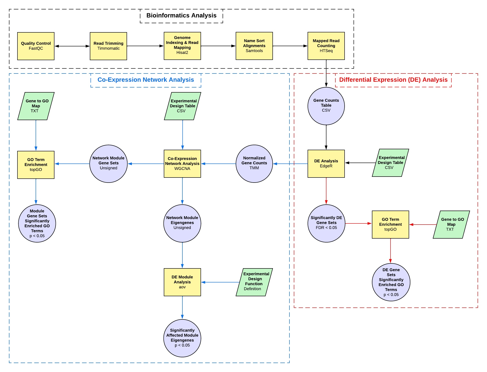
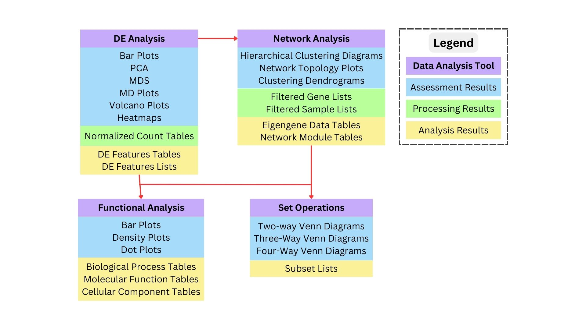

# DGEAnalysis_ShinyApps

These are R shiny applications provide a framework for analyzing biological data produced by genomic sequencing technologies, such as RNA-seq. Users are guided through biological data assessment, processing and analysis. The different analyses available include differential expression (DE), network, and functional analysis.

## Shiny Applications & Features
* <b>DE Analysis</b> with edgeR
	* Clustering analysis using distance based PCA and MDS
	* Filtering
 		* to remove lowly-expressed genes
 		* by FDR adjusted p-value cut off
 		* by LFC cut off (exact tests only, since GLMs account for LFC cut offs)
	* Exact tests
	* ANOVA like analysis using GLMs
* <b>Network Analysis</b> with WGCNA
	* Clustering analysis using hierarchical clustering
	* Filtering to
 		* remove bad genes and samples
 		* select genes associated with particular modules
	* Unsigned networks
* <b>Functional Analysis</b> with topGO
	* Over-representation analysis using Fisher's exact tests
	* Enrichment like analysis using rank based Kolmogrov-Smirnov (KS) tests
	* Filtering
 		* by unadjusted p-value cut off
 		* by candidate GO term list
* <b>Set Operations</b> with ggVennDiagram
	* Venn diagrams with ggVennDiagram
	* Extraction of subsets with gplots

## Analysis Framework 

The following diagram shows the analysis framework for the applications, in addition to potential prep-processing steps. 



Multiple bioinformatics software tools are commonly used to pre-process RNA-seq data. The software used in the development of this analysis framework is shown.

The analysis workflow for the applications begins with the assessment and processing of count data using edgeR, which can then be followed by DE analysis.

The normalized data output by edgeR can also be input to WGCNA to begin the network analysis process.

Results from the DE or network analyses can be used to perform downstream analyses, such as functional analysis or set operations.

## Analysis Results

Each of the applications produces multiple resulting plots and tables, which are shown in the diagram below.



## Tutorials

> [!IMPORTANT]
> The tutorials for using the applications or creating scripts for the different analyses can be found in the [tutorials](https://github.com/ElizabethBrooks/DGEAnalysis_ShinyApps/tree/main/tutorials) folder of this repository.

Additional tutorials are available on the following pages of my website, go into further detail about the different analyses and other helpful information.
* Helpful information for downloading the applications in this repository can be found in the tutorial [GitHub Version Control Quick Start Guide](https://morphoscape.wordpress.com/2024/02/28/github-version-control-quick-start-guide/).
* A tutorial of the biostatistical analysis performed in this application is provided in [Downstream Bioinformatics Analysis of Omics Data with edgeR](https://morphoscape.wordpress.com/2022/08/09/downstream-bioinformatics-analysis-of-omics-data-with-edger/).
* Gene tables were may be created from RNA-seq data as described in [Bioinformatics Analysis of Omics Data with the Shell & R](https://morphoscape.wordpress.com/2022/07/28/bioinformatics-analysis-of-omics-data-with-the-shell-r/).

### Example Data Sets

Example gene counts and experimental design tables are also provided in the [data](https://github.com/ElizabethBrooks/DGEAnalysis_ShinyApps/tree/main/data) folder of this repository.

A sample RNA-seq data set may also be obtained from [NCBI](https://www.ncbi.nlm.nih.gov/bioproject/PRJNA504739/), for example.

## Installation & Running

Each of the R shiny applications can be run locally on your computer using R and Posit. Continue reading for helpful information on installing and running the apps.

### Installation

<b>First,</b> download this GitHub repository using the git clone command in the terminal as follows.

To download the code onto a local computer or server space, click the green <i>< > Code</i> button and copy the link. Then, using the HTTPS web URL in the terminal:

git clone https://github.com/ElizabethBrooks/DGEAnalysis_ShinyApps.git

Alternatively, using SSH:

git clone git@github.com:ElizabethBrooks/DGEAnalysis_ShinyApps.git

The latest version of this application may also be downloaded from this repository by clicking the green <i>< > Code</i> button near the top of the page, and then clicking <i>Download ZIP</i>.

<b>Second</b>, if running the app locally, you will need to install or update [R and Posit](https://posit.co/download/rstudio-desktop/).

<b>Third</b>, open Posit (formerly RStudio) and before clicking the <i>Run App</i> button, make sure to install all of the necessary R packages for each of the applications.

### DE Analysis with edgeR
```
packageList <- c("BiocManager", "shiny", "shinythemes", "ggplot2", "rcartocolor", "dplyr", "statmod", "pheatmap", "ggplotify")
biocList <- c("edgeR")
newPackages <- packageList[!(packageList %in% installed.packages()[,"Package"])]
newBioc <- biocList[!(biocList %in% installed.packages()[,"Package"])]
if(length(newPackages)){
  install.packages(newPackages)
}
if(length(newBioc)){
  BiocManager::install(newBioc)
}
```

### Network Analysis with WGCNA
```
packageList <- c("BiocManager", "shiny", "shinythemes", "dplyr", "matrixStats", "Hmisc", "splines", "foreach", "doParallel", "fastcluster", "dynamicTreeCut", "survival")
biocList <- c("WGCNA", "GO.db", "impute", "preprocessCore")
newPackages <- packageList[!(packageList %in% installed.packages()[,"Package"])]
newBioc <- biocList[!(biocList %in% installed.packages()[,"Package"])]
if(length(newPackages)){
  install.packages(newPackages)
}
if(length(newBioc)){
  BiocManager::install(newBioc)
}
```

### Functional Analysis with topGO
```
packageList <- c("BiocManager", "shiny", "shinythemes", "ggplot2", "rcartocolor", "tidyr")
biocList <- c("topGO", "Rgraphviz")
newPackages <- packageList[!(packageList %in% installed.packages()[,"Package"])]
newBioc <- biocList[!(biocList %in% installed.packages()[,"Package"])]
if(length(newPackages)){
  install.packages(newPackages)
}
if(length(newBioc)){
  BiocManager::install(newBioc)
}
```

### Set Operations with ggVennDiagram
```
packageList <- c("BiocManager", "shiny", "shinythemes", "ggplot2", "rcartocolor", "ggVennDiagram", "gplots")
newPackages <- packageList[!(packageList %in% installed.packages()[,"Package"])]
if(length(newPackages)){
  install.packages(newPackages)
}
```

### Running

> [!TIP]
> To run the selected app, open the R script for the app in Posit and press the <i>Run App</i> button in the upper right corner of the [source pane](https://docs.posit.co/ide/user/ide/guide/ui/ui-panes.html).

After the app is launched you will see the following pages:
1. <i>Getting Started</i> page with information for uploading data to start the analysis
2. <i>Processing</i> page that indicates the analysis has begun running
3. a page with separate tabs for each step in the analysis workflow

## Methods

### DE Analysis with edgeR

Differential expression (DE) analysis can be used to identify DE genes using the edgeR package (Chen, Lun & Smyth, 2016) in R (R Core Team, 2023). Library sizes are calculated for each sample before normalizing with trimmed mean of M-values (TMM) between each pair of samples. The clustering of samples with a PCA is performed using edgeR to create a multidimensional scaling (MDS) plot of the distances between gene expression profiles, in which the same genes are selected for all comparisons. Two-way ANOVAs is calculated using generalized linear models (GLMs) to identify genes with significant DE above an input log2 fold-change (LFC) threshold using t-tests relative to a threshold (TREAT) with the glmTreat function of edgeR (McCarthy & Smyth, 2009). The resulting tables of DE genes can be filtered by statistical or biological significance, including false discoverey rate (FDR) or LFC.

### Network Analysis with WGCNA

Gene co-expression networks can be generated to increase the power of functional analyses. Networks should be constructed with the log-transformed normalized gene counts using the R package WGCNA (Langfelder & Horvath, 2008; Zhang & Horvath, 2005). An unsigned network can be created to enable the detection of modules with genes that have mixed directions of expression. The co-expression networks should be manually constructed with a recommended minimum module size of 30 and soft thresholding power of 9, which is where the scale free topology model fit was above 0.8 and mean connectivity under the hundreds (Horvath, 2011).

### Functional Analysis with topGO

Significantly over-represented or enriched GO terms can be determined using the R package topGO (Alexa & Rahnenfuhrer, 2022) to perform Fisher's exact or Kolmogorov-Smirnov (KS) like tests. These tests allow users to identify any pathways observed in the selected set of genes more than expected by chance against the background set of all genes that were sufficiently expressed for further analysis given the sample library sizes and experimental design. The genes that were sufficiently expressed for further analysis were determined using the filterByExpr function of edgeR.

### Set Operations with ggVennDiagram

The intersection of DE genes and modules can be identified by comparing the sets of genes placed in each network module to the set of DE genes. The genes contained in the intersections of sets are extracted using the venn function of the gplots R package (Warnes et al., 2022). The set relationships are visualized using the ggVennDiagram package (Gao et al., 2024).

## References

Chen, Y., Lun, A. T., & Smyth, G. K. (2016). From reads to genes to pathways: differential expression analysis of RNA-Seq experiments using Rsubread and the edgeR quasi-likelihood pipeline. F1000Research, 5, 1438. https://doi.org/10.12688/f1000research.8987.2.

R Core Team (2023). _R: A Language and Environment for Statistical Computing_. R Foundation for Statistical Computing, Vienna, Austria. <https://www.R-project.org/>.

Davis J. McCarthy, Gordon K. Smyth, Testing significance relative to a fold-change threshold is a TREAT, Bioinformatics, Volume 25, Issue 6, March 2009, Pages 765–771, https://doi.org/10.1093/bioinformatics/btp053.

Langfelder, P., Horvath, S. WGCNA: an R package for weighted correlation network analysis. BMC Bioinformatics 9, 559 (2008). https://doi.org/10.1186/1471-2105-9-559

Horvath S (2011) Weighted Network Analysis. Applications in Genomics and Systems Biology. Springer Book. ISBN: 978-1-4419-8818-8.

Alexa A, Rahnenfuhrer J (2023). topGO: Enrichment Analysis for Gene Ontology. doi:10.18129/B9.bioc.topGO, R package version 2.54.0, https://bioconductor.org/packages/topGO.

Gao, C.-H., Chen, C., Akyol, T., Dușa, A., Yu, G., Cao, B., and Cai, P. (2024). ggVennDiagram: intuitive Venn diagram software extended. iMeta 3, 69. doi: 10.1002/imt2.177.

## Acknowledgements

The applications were created by [Elizabeth Brooks](https://www.linkedin.com/in/elizabethmbrooks/).

This project was supported by the National Science Foundation grant "Collaborative Research: EDGE FGT: Genome-wide Knock-out mutant libraries for the microcrustacean Daphnia"  (2220695/2324639  to Sen Xu and 2220696 to Michael E. Pfrender).
