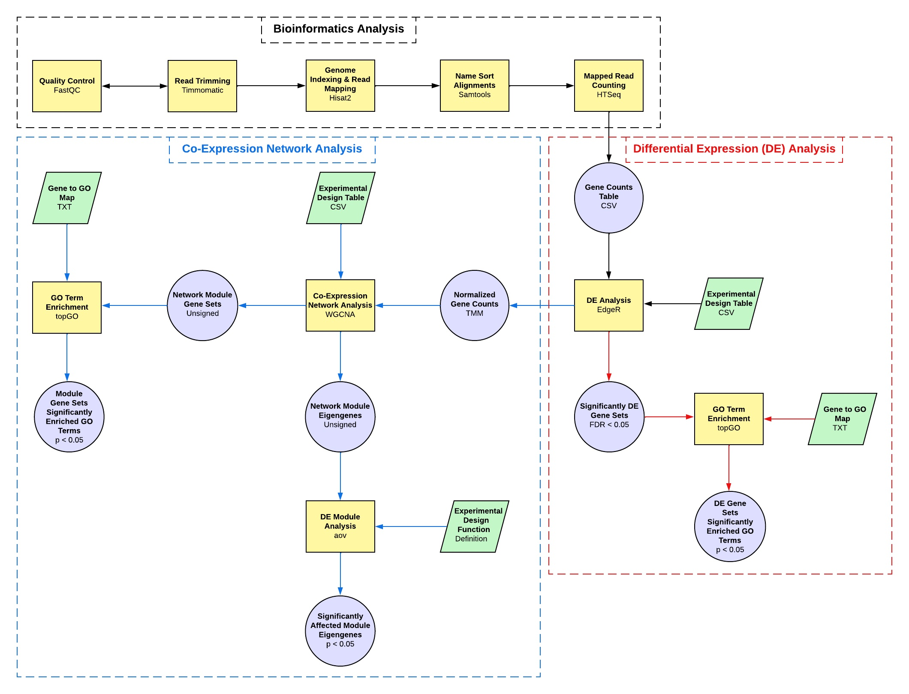

# DGEAnalysis_ShinyApps

These are shiny applications for various differential gene expression (DGE) analysis created by [Elizabeth Brooks](https://www.linkedin.com/in/elizabethmbrooks/).

The latest version of this application may be downloaded from this repository.

## Example Data Sets

Example gene counts and experimental design tables are also provided in the [data directory](https://github.com/ElizabethBrooks/DGEAnalysis_ShinyApps/tree/main/data) of this repository.

An example RNA-seq data set may be obtained from [ScienceDirect](https://www.sciencedirect.com/science/article/pii/S0147651319302684) and [NCBI](https://www.ncbi.nlm.nih.gov/bioproject/PRJNA504739/).

## Helpful Information

Gene tables were may be created from RNA-seq data as described in [Bioinformatics Analysis of Omics Data with the Shell & R](https://morphoscape.wordpress.com/2022/07/28/bioinformatics-analysis-of-omics-data-with-the-shell-r/).

A tutorial of the biostatistical analysis performed in this application is provided in [Downstream Bioinformatics Analysis of Omics Data with edgeR](https://morphoscape.wordpress.com/2022/08/09/downstream-bioinformatics-analysis-of-omics-data-with-edger/).

## Acknowledgements

This project was funded by the National Science Foundation grant "Collaborative Research: EDGE FGT: Genome-wide Knock-out mutant libraries for the microcrustacean Daphnia"  (2220695/2324639  to Sen Xu and 2220696 to Michael E. Pfrender).

## DGE Analysis Pipeline 

